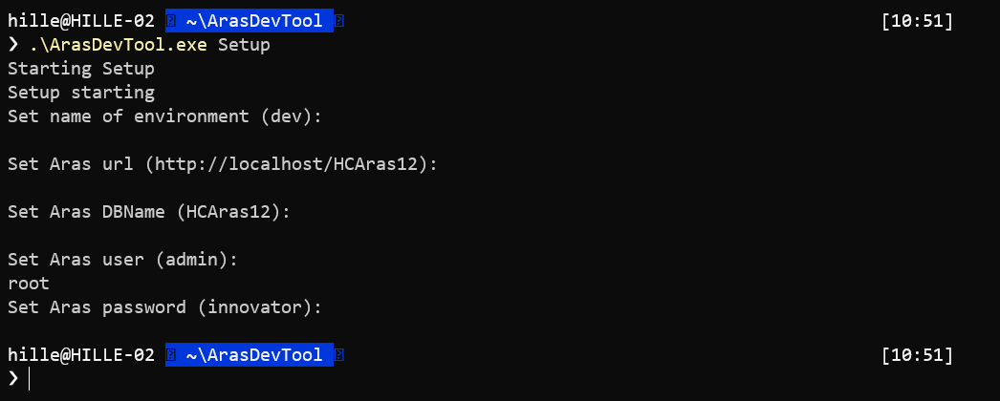
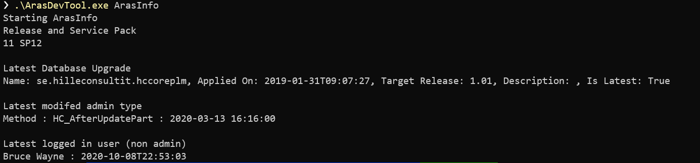
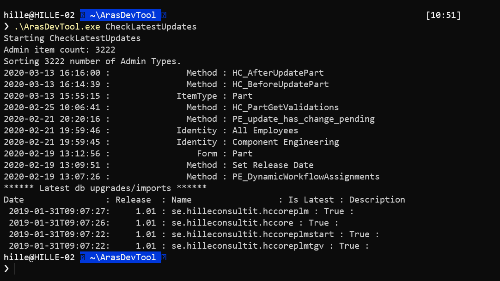
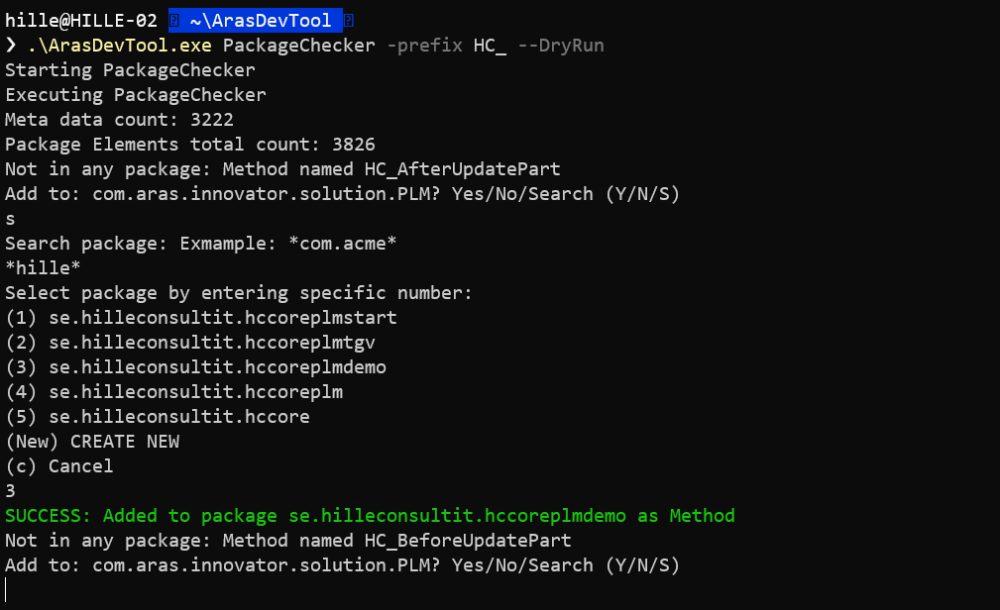

# ArasDeveloperTool

Command Line Application for handling developer tasks in Aras Innovator

**Table of contents**

- [Install](#install)
- [How To Use](#how-to-use)
  - [Setup an Aras connection (Setup)](#setup-an-aras-connection-setup)
  - [Aras Info](#aras-info)
  - [Check Latest Updates (CheckLatestUpdates)](#check-latest-updates-checklatestupdates)
  - [Check if Items are in packages (PackageChecker)](#check-if-items-are-in-packages-packagechecker)
  - [Backup/Restore Database (Database)](#backuprestore-database-database)
  - [AMLRunner](#amlrunner)
  - [ApplyMethod](#applymethod)
  - [RestoreMethod](#restoremethod)
  - [CreatedItemTypesCount](#createditemtypescount)
- [Release Notes](#release-notes)

## Install

To install it as a tool this requires an installed dotnet sdk (6 or 7 seven should work)

``` powershell
dotnet tool install --global ArasDeveloperTool
```


## How To Use

Once it is installed run command `adt` (ArasDeveloperTool) command in Cmd/Powershell/Windows Terminal

``` powershell
adt
```

``` log
Help for: ArasDevTool
  Available commands:
  AmlRunner
  ApplyMethod
  ArasInfo
  BackupDB
  CheckLatestUpdates
  CreatedItemTypesCount
  Dummy
  ListEnvironments
  PackageChecker
  RestoreDB
  RestoreMethod
  Setup
  TestConnection

  Options:
    --help    Displays help for a command
  Version: 4.0.1

```

⚠️ NOTE: The old images below shows adt, which is equivalent to adt. adt is just the tool command.

### Setup an Aras connection (Setup)

``` powershell
adt Setup
```



``` powershell
adt Setup -ext
#Extended setup: Configure Database for Backup/Restore
```

It is an option to explicitly use a "Aras ConnectionString" in Aras Commands:
E.g.  

``` powershell
adt TestConnection --cs="http://localhost/Innovator;InnovatorSolutions;admin;innovator"
#Or
adt TestConnection --cs="http://localhost/Innovator;InnovatorSolutions;admin"
# To be promted for password
```

### Aras Info

``` powershell
adt ArasInfo
```



### Check Latest Updates (CheckLatestUpdates)

``` powershell
adt CheckLatestUpdates 
```



``` powershell
adt CheckLatestUpdates --help
```

``` log
Help for: CheckLatestUpdates
  Specify connection string: E.g.
   -cs="http://localhost/innovator;InnovatorSolutions;admin;innovator"
   -cs="http://localhost/innovator;InnovatorSolutions;admin"
  Or environment: E.g.
  -env dev
  Non specified is equivalent with '-env dev'

Options: -c
  (Number of items to show: "-c 20"

```

### Check if Items are in packages (PackageChecker)

``` powershell
adt PackageChecker -prefix HC_
```



``` powershell
adt CheckLatestUpdates --help
```

``` log
Help for: PackageChecker
  Specify connection string: E.g.
   -cs="http://localhost/innovator;InnovatorSolutions;admin;innovator"
   -cs="http://localhost/innovator;InnovatorSolutions;admin"
  Or environment: E.g.
  -env dev
  Non specified is equivalent with '-env dev'

  Parameters:
    -prefix        Check Items with specific prefix. Example: "-prefix HC_"
  Options:
  --DryRun       Don´t commit any changes.
  --Auto         Let it automatically select package for you.
```

### Backup/Restore Database (Database)

If you have setup the extended setup database backup and restore is possible via

``` powershell
adt BackupDB 
```

``` powershell
adt RestoreDB
```

### AMLRunner

Run AMLs from files

``` powershell
adt AMLRunner -mf \AMLRunner\AmlRunnerTest.mf
```

Example of manifest file running aml-files in the Pack1 and Pack2 directories. Where if the any aml fails in Pack2, execution will be stopped.

``` xml
<?xml version="1.0" encoding="utf-8" ?>
<imports>
  <package  path="Pack1" />
  <package path="Pack2" stopOnError="TRUE" />
</imports>
```

Example Test1.xml in directory Pack1

``` xml
<AMLS>
  <AML>
    <Item action="delete" type="Form" id="F596909BBC7746D99683DB1E759E582E">
    </Item>
  </AML>
   <AML>
    <Item action="delete" type="Field" id="53ADDFF20E5C43B7B51A5E4B818465E3">
    </Item>
  </AML>
</AMLS>
```

Or user the -file parameters to execute a single file of AML(s) like:

``` powershell
adt AMLRunner -file \AMLRunner\Pack1\Test1.xml
```

### ApplyMethod

Run an ApplyMethod

``` powershell
adt ApplyMethod -name HC_Motd
```

Output

``` powershell
Executing ApplyMethod
SUCCESS:
    Message of the day
    Don't forget to unlock your items Finish your tasks Be good
```

### RestoreMethod

'Restore' a specified Method to previous generation or a specified date"
Prints out the method_code of the restored method.
The restore locates a previous generation of the method and makes an edit with the content and 'comments'

``` powershell
adt RestoreMethod -name HC_Motd -toDate 2023-06-05T08:45
Executing RestoreMethod
SUCCESS:
    return this.getInnovator().newResult("Don't forget to unlock your items Finish your tasks Be good");
```

### CreatedItemTypesCount

List number of instances created for each Item Type in Aras, ordered descending on highest number of instances.

Options:
-month {yyyy-MM} #(default previous month)
-count-display-threshold {int} #(default 5)

**Example:**

``` powershell
adt CreatedItemTypesCount
```

Output:

``` log
New Aras Connection: http://localhost/2023, 2023, root , 90
Executing CreatedItemTypesCount
790       Part
191       Express ECO
123       Document
85        Affected Item
85        Express ECO Affected Item
8         SavedSearch
```

## Release Notes

See [Release Notes](./Documentation/ReleaseNotes.md)
💡NOTE: This was converted from .NET Framework to .NET Core in September 2023. So older releases (pre 4.0.1) are built on the .NET Framework.
